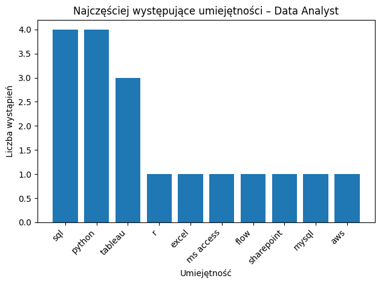

# Wprowadzenie
Ten projekt został zrealizowany w języku SQL i ma na celu analizę rynku pracy dla stanowiska Analityk Danych na podstawie ofert pracy.

**Główne cele projektu:**

- identyfikacja najbardziej pożądanych umiejętności wśród Analityków Danych,

- analiza zależności między popytem na konkretne kompetencje a poziomem wynagrodzeń,

- określenie, które umiejętności oferują najlepszy kompromis między częstością występowania a płacą.

Link do SQL queries: 
[project_sql folder](/project_sql/) 
# Kontekst projektu
Motywacją stojąca za przygotowaniem tego projektu było zrozumienie rynku pracy Analizy Danych i zaplanowanie optymalnej ścieżki nauki.

Pytania, na które chciałem odpowiedzieć za pomocą  SQL, brzmiały: 
1. Jakie są najwyższe wyngrodzenia?
2. Jakie umiejętności są wymagane na najlepiej płatnych stanowiskach? 
3. Jakie umiejętności są najbardziej poszukiwane u Analityków Danych? 
4. Które umiejętności wiążą się z wyższymi zarobkami? 
5. Jakie są najbardziej optymalne umiejętności do nauki dla Analityka Danych, który chce zmaksymalizować wartość rynkową?
# Wykorzystane narzędzia
W tym projekcie wykorzystałem różnorodne narzędzia do przeprowadzenia analizy: 
- **SQL (Structured Query Language):** Umożliwił mi interakcję z bazą danych, wyciąganie wniosków i odpowiadanie na kluczowe pytania za pomocą zapytań. 
- **PostgreSQL:** Jako system zarządzania bazą danych, PostgreSQL umożliwił mi przechowywanie, wyszukiwanie i przetwarzanie danych z ofert pracy. 
- **Visual Studio Code:** Ta platforma administracyjno-programistyczna typu open source pomogła mi zarządzać bazą danych i wykonywać zapytania SQL.
# Analiza danych
Każde zapytanie w ramach tego projektu miało na celu zbadanie konkretnych aspektów rynku pracy analityków danych. 

### 1. Najwyższe wynagrodzenie wśród Analityków Danych 
Aby zidentyfikować najlepiej płatne stanowiska, przefiltrowałem stanowiska analityka danych według średniego rocznego wynagrodzenia. 
To zapytanie wskazuje na możliwości wysokich zarbków dla Analityków Danych.
```sql
--Top 10 najwyższego wyngrodzenia dla Analityków Danych
SELECT
	job_id,
	job_title,
	job_location,
	job_schedule_type,
	salary_year_avg,
	job_posted_date,
	name AS company_name
FROM
	job_postings_fact
LEFT JOIN company_dim ON job_postings_fact.company_id = company_dim.company_id
WHERE
	job_title = 'Data Analyst'
	AND salary_year_avg IS NOT NULL

ORDER BY
	salary_year_avg DESC 
LIMIT 10
```
**💰 Top 10 najlepiej płatnych ofert – Data Analyst**

| Job Title    | Salary (USD / year) | Company                     |
|-------------|---------------------:|-----------------------------|
| Data Analyst | 650000               | Mantys                      |
| Data Analyst | 350000               | Anthropic                   |
| Data Analyst | 240000               | Anthropic                   |
| Data Analyst | 225000               | GovCIO                      |
| Data Analyst | 175000               | Xator Corp                  |
| Data Analyst | 175000               | Centauri                    |
| Data Analyst | 175000               | Meta                        |
| Data Analyst | 170000               | Motion Recruitment          |
| Data Analyst | 166100               | Noblis                      |
| Data Analyst | 165000               | Plexus Resource Solutions   |

### 2. Najczęściej występujące umiejętności wśród 10 najlepiej zarabiających Analityków Danych

Aby uzyskać najczęściej występujące umiejętności u najlepiej zarabiających Analityków Danych połączyłem ogłoszenia o prace z danymi dotyczącyymi umiejętności.
Otrzymałem informację jakie umiejętności pracodawcy najbardziej cenią.

```sql
-- Umiejętności najlepiej zarabiających analityków danych
WITH top_paying_jobs AS (
SELECT
	job_id,
	job_title,
	job_location,
	job_schedule_type,
	salary_year_avg,
	job_posted_  date,
	name AS company_name
FROM
	job_postings_fact
LEFT JOIN company_dim ON job_postings_fact.company_id = company_dim.company_id
WHERE
	job_title = 'Data Analyst'
	AND salary_year_avg IS NOT NULL
	ORDER BY
	salary_year_avg DESC 
LIMIT 10
)
SELECT
	top_paying_jobs.job_id,
	top_paying_jobs.job_title,
	top_paying_jobs.company_name,
  skills
FROM top_paying_jobs
INNER JOIN skills_job_dim ON skills_job_dim.job_id=top_paying_jobs.job_id
INNER JOIN skills_dim ON skills_dim.skill_id=skills_job_dim.skill_id
```




🥇 Umiejętności kluczowe (core skills)

SQL – 5

Python - 4

Tableau - 3


Najważniejsze wnioski 🚀

SQL 🧱 + Python 🐍 = absolutna podstawa analityka danych

Tableau 📊 = klucz do komunikacji z biznesem
### 3. Najbardziej porządane umiejętności u Analityka Danych bez względu na zarobki (Top 5)
To zapytanie pomogło zidentyfikować na jakie umiejętności jest największe zapotrzebowanie na rynku pracy.

```sql
SELECT
    skills,
    COUNT(skills_job_dim.job_id) 
FROM job_postings_fact
    INNER JOIN skills_job_dim ON skills_job_dim.job_id=job_postings_fact.job_id
    INNER JOIN skills_dim ON skills_dim.skill_id=skills_job_dim.skill_id
    WHERE 
        job_title_short = 'Data Analyst' 
GROUP BY skills
ORDER BY count DESC
LIMIT 5

```
**🔑 Najczęściej wymagane umiejętności – Data Analyst**
| Skill     | Liczba wystąpień |
|-----------|------------------|
| SQL       | 92 628           |
| Excel     | 67 031           |
| Python    | 57 326           |
| Tableau   | 46 554           |
| Power BI  | 39 468           |

**Co pokazują dane?**

Dane pokazują, że najważniejszą umiejętnością dla osoby zaczynającej pracę jako Data Analyst jest **SQL**, ponieważ występuje w ofertach najczęściej. **Excel** i **Python** są kolejnymi kluczowymi narzędziami do analizy i pracy z danymi. Obecność **Tableau** i **Power BI** wskazuje, że ważna jest także umiejętność czytelnego prezentowania wyników w formie wykresów i dashboardów.

### 4. Najlepiej płatne umiejętności 
Analiza średnich wynagordzeń dla poszczególnych umiejętności pozwoliła ustalić, które z nich przynoszą najwyższe zarobki.
```sql
-- Identyfikuje najlepiej płatne umiejętności
SELECT
    skills,
    ROUND(AVG(salary_year_avg), 0) AS avg_salary
FROM job_postings_fact
    INNER JOIN skills_job_dim ON skills_job_dim.job_id=job_postings_fact.job_id
    INNER JOIN skills_dim ON skills_dim.skill_id=skills_job_dim.skill_id
    WHERE 
        job_title_short = 'Data Analyst' 
        AND
        salary_year_avg IS NOT NULL
GROUP BY skills
ORDER BY avg_salary DESC
limit 25
```
***Wnioski w 3 punktach***

1️⃣ Wysokie wynagrodzenie = rzadkość + odpowiedzialność, nie „popularność”
Najlepiej płatne kompetencje są albo niszowe (SVN, Perl), albo obarczone dużym ryzykiem biznesowym (Solidity). Rynek płaci premię za brak zastępowalności i odpowiedzialność za systemy krytyczne, a nie za modne, masowe technologie.

2️⃣ Ciężar rynku przesuwa się z analizy w stronę infrastruktury i wdrożeń. Wyżej wyceniane są kompetencje związane z Data Engineering, MLOps i DevOps (Terraform, Kafka, Airflow, Couchbase) niż same narzędzia analityczne czy 
 frameworki ML. Dane i AI muszą działać w produkcji — i za to się dziś płaci.

3️⃣ Największą wartość ma myślenie systemowe, nie pojedynczy skill Narzędzia są wymienne, ale zdolność łączenia technologii, procesów i zespołów (GitLab, Atlassian, Notion) jest trwałą przewagą. Seniorzy zarabiają więcej, bo zarządzają 
złożonością, a nie dlatego, że znają jeden framework lepiej od innych.

### 5. Najbardziej optymalne umiejętności
Połączyłem najlepiej opłacane umiejętności z umiejętnościami na które był najwiekszy popyt dzięki czemu uzyskałem obraz najbardziej optymalnych umiejętności.
```sql
-- Indenyfikuje optymalne umiejętności względem popytu oraz wynagrodzenia 
WITH 
top_paying AS 
(
SELECT
    skills_dim.skill_id,
    skills_dim.skills,
    ROUND(AVG(salary_year_avg), 0) AS avg_salary
FROM job_postings_fact
    INNER JOIN skills_job_dim ON skills_job_dim.job_id=job_postings_fact.job_id
    INNER JOIN skills_dim ON skills_dim.skill_id=skills_job_dim.skill_id
    WHERE 
        job_title_short = 'Data Analyst' 
        AND
        salary_year_avg IS NOT NULL
 GROUP BY skills_dim.skill_id
),
 top_demand AS
(
SELECT
    skills_dim.skill_id,
    skills_dim.skills,
    COUNT(skills_job_dim.job_id) AS job_count
FROM job_postings_fact
    INNER JOIN skills_job_dim ON skills_job_dim.job_id=job_postings_fact.job_id
    INNER JOIN skills_dim ON skills_dim.skill_id=skills_job_dim.skill_id
    WHERE
        job_title_short = 'Data Analyst' 
        AND
        salary_year_avg IS NOT NULL
        GROUP BY skills_dim.skill_id
)
SELECT
top_demand.skills,
avg_salary,
job_count
FROM top_demand
INNER JOIN top_paying ON top_demand.skill_id=top_paying.skill_id
WHERE top_demand.job_count > 10
ORDER BY 
avg_salary DESC,
job_count DESC

-- Zapytanie po optymalizacji

SELECT
skills_dim.skill_id,
skills_dim.skills,
ROUND(AVG(salary_year_avg), 0) AS avg_salary,
COUNT(skills_job_dim.job_id) AS job_count
FROM job_postings_fact
    INNER JOIN skills_job_dim ON skills_job_dim.job_id=job_postings_fact.job_id
    INNER JOIN skills_dim ON skills_dim.skill_id=skills_job_dim.skill_id
WHERE
    job_title_short = 'Data Analyst' 
    AND
        salary_year_avg IS NOT NULL
  GROUP BY skills_dim.skill_id
    HAVING COUNT(skills_job_dim.job_id) > 10
ORDER BY
    avg_salary DESC,
    job_count DESC
```

***Wnioski:***

🚀 Najbardziej „optymalne” skille rynkowo (wysoka płaca + realny popyt) to technologie big data i cloud: Spark, Snowflake, Databricks, Airflow oraz  AWS / Azure / GCP – dają najlepszy zwrot z inwestycji czasowej.

🧱 Skille bazowe (SQL, Python, Excel, Tableau, Power BI) mają ogromny popyt, ale nie różnicują wynagrodzeń – są niezbędnym fundamentem, lecz nie dźwignią  płacową i to na nich początkujący analityk powinien się skupić.

🎯 Bardzo wysokie średnie płace przy niskim popycie (Kafka, frameworki ML) 
wskazują na nisze eksperckie – opłacalne dopiero po zbudowaniu solidnego core data/engineering.

# Czego się nauczyłem?

Podczas tego projektu udoskonaliłem kilka kluczowych technik i umiejętności SQL:
- ***Konstrukcja złożonych zapytań:*** Nauka tworzenia zaawansowanych zapytań SQL, które łączą wiele tabel i wykorzystują funkcje takie jak klauzule WITH dla tabel tymczasowych. 
- ***Agregacja danych:*** Wykorzystanie funkcji GROUP BY i agregujących takich jak COUNT() i AVG() do efektywnego podsumowywania danych. 
- ***Myślenie analityczne:*** Rozwijanie umiejętności tłumaczenia rzeczywistych pytań na wykonalne zapytania SQL, które dają wnikliwe odpowiedzi. 
# Wnioski 
Z analizy wyłoniło się kilka ogólnych wniosków: 

1. ***Najlepiej płatne stanowiska analityka danych:*** Najlepiej płatne stanowiska dla analityków danyc oferują szeroki zakres wynagrodzeń, najwyższe w wysokości 650 000 USD! 

2. ***Umiejętności na najlepiej płatnych stanowiskach:*** Dobrze płatne stanowiska analityka danych wymagają zaawansowanej znajomości SQL, python ora Tableau co sugeruje, że są to fundamentalnie ważne umiejętności dla osiągnięcia wysokich zarobków.

3. ***Najbardziej poszukiwane umiejętności:*** 
Tak jak w przypadku pkt. 2 SQL, python oraz umiejętność wizualizacji danych wiedzie prym. Do zestawienia w top 5 dołączył również excel (2 miejsce) co czyni go doskonałym kandydatem do nauki przez początkujące Analityka Danych.

4. ***Umiejętności z wyższymi zarobkami:*** 
Specjalistyczne umiejętności, takie jak SVN, Solidity, Perl wiążą się z najwyższymi średnimi zarobkami, co wskazuje na przewagę niszowych kompetencji. 

5. ***Optymalne umiejętności dla wartości rynkowej:*** 
Najbardziej opłacalne rynkowo są dziś kompetencje z obszaru big data i chmury (Spark, Snowflake, Databricks, Airflow, AWS/Azure/GCP), bo łączą wysokie wynagrodzenia z realnym popytem. Umiejętności bazowe (SQL, Python, Excel, Tableau, Power BI) są niezbędnym fundamentem – gwarantują zatrudnialność, ale rzadko podnoszą płace. Bardzo wysokie stawki przy niskim popycie (np. Kafka, frameworki ML) oznaczają nisze eksperckie. Opłacają się one dopiero po zbudowaniu solidnego „core” data/engineering.

# Wnioski końcowe
Ten projekt rozwinął moje umiejętności w zakresie SQL i dostarczył cennych informacji na temat rynku pracy analityków danych. Wyniki analizy służą jako wskazówka do priorytetyzacji rozwoju umiejętności i działań związanych z poszukiwaniem pracy. Aspirujący analitycy danych mogą lepiej pozycjonować się na konkurencyjnym rynku pracy, koncentrując się na umiejętnościach o wysokim zapotrzebowaniu i wysokich zarobkach. Niniejsza analiza podkreśla znaczenie ciągłego uczenia się i adaptacji do pojawiających się trendów w dziedzinie analityki danych.

